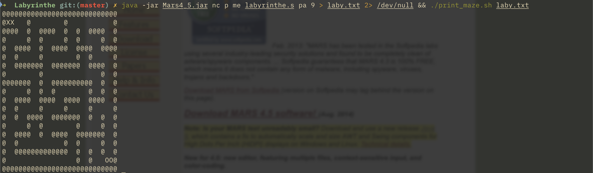

# Projet Labyrinthe

[](README.md)
[](README.fr.md)

Ceci est le projet Labyrinthe. Il s'agit d'un générateur de labyrinthe carré aléatoire de taille donnée à une et une seule solution. Il est écrit en assembleur MIPS et s'exécute dans le simulateur MARS. Il génère un labyrinthe aléatoire à chaque exécution avec une unique solution.



## Introduction

Ce projet a été réalisé dans le cadre de l'UE "Architecture des Ordinateurs" du semestre 3 de la licence Informatique de l'Université de Strasbourg, durant l'année universitaire 2022-23. Il a été fait dans **6 jours** pendant les vacances de la semaine du 31 octobre pour être rendu le dimanche 6 novembre. 😳

Le fichier rendu du projet est celui nommé `labyrinthe.s` contenant du code source assembleur MIPS. Il est à executer avec le simulateur [MARS](http://courses.missouristate.edu/KenVollmar/MARS/) inclus.

Avec le [pdf du sujet](https://git.unistra.fr/erken/labyrinthe/-/blob/master/ProjetArchi.pdf) vous pouvez vous renseigner sur le projet. Malheureusement d'un point de vue optimisation, complexité et efficacité, il n'est pas le meilleur même si j'ai suivi avec précision la progression conseillée.

### Correction finale (14.11.2023)

Au moment de rendu de ce projet le 06.11.2022, pour plusieurs raisons (contrainte de temps sévère, être un développeur novice sans beaucoup de vision...), je n'avais pas pu réussir les demandes du sujet et le spec à 100%. Notamment, j'avais remplacé l'algorithme décrit dans le sujet par un plus simple par fausse impression et peur de complexité et temps d'exécution non envisageable. Mais au moment je me suis rendu compte qu'en fait il n'y avait pas de problème, c'était trop tard pour réécrire des parties pour implementer l'algorithme proposé comme tel et se débarrasser des déviations introduits par rapport au sujet.

Cette différence dans le choix d'algorithme était la raison pour laquelle la sortie (le labyrinthe aléatoire généré à une unique solution) n'était même pas proche des exemples dans le sujet. Pourtant jusqu'à l'étape finale qui était la sortie, tous les autres systèmes internes marchait sans soucis. Mais à cet époque là je pensais le problème plus grand et plus compliqué que juste la différence dans l'algorithme.

Le fait que je n'avais pas pu fournir un résultat au spec, principalement à cause de la contrainte de temps me dérangeait depuis que j'avais rendu le projet. Mais malheureusement l'année scolaire continuait à toute vitesse et je ne pouvais pas revenir à ce projet pour le laisser dans un état correcte et complet.

Mais, me voici 💪, de retour le 14.11.2023 (après exactement un an, quelle coïncidence 🤔) pour ne pas laisser mes efforts en vain, ayant accumulé plus de connaissances et de l'expérience en informatique (maintenant en L3) pour corriger le passé. Un dernier effort, pour laisser ce projet reposer en paix, ça le mérite... 🫡

Les quelques petits changements (surprenant comment c'était simple en fait) que j'ai fait sont les suivants :

* Changer le seed pour le générateur pseudo aléatoire dans `Alea.s` par l'horloge système à chaque appel pour avoir un génération de labyrinthe correctement aléatoire.
* Remplacer l'algorithme complètement par celui dans le sujet situé dans la fonction `generer_laby`. (Mon algorithme dévié parcourait les cellules du labyrinthe linéairement une seule fois en choisissant à chaque fois un voisin non visité pour chaque cellule et casser le mur entre ces deux. Bien sûr que cela ne garantissait pas un labyrinthe aléatoire à une unique solution comme demandé dans le spec. Alors j'ai remplacé l'algorithme par celui proposé dans le sujet mot à mot. Mettre la première cellule du labyrinthe dans une pile en la marquant visité. Tant que la pile n'est pas vide faire de la tête de la pile la cellule courante, rechercher ses voisins non visités, en choisir un au hasard s'il y en a, casser le mur entre ces deux cellules, empiler ce voisin, si la cellule courante n'a plus de voisin non visité alors dépiler.)
  * Utiliser le deuxième octet des mots mémoire qui stockent les cellules du labyrinthe pour stocker les indices des cellules dans les cellules mêmes, sans autre structure de donnée (bits numéro 8+) dans la pile représentant le labyrinthe. (Extension au sujet du projet parce que je suis paresseux pour faire plus, mon but n'est rien d'autre à ce moment là de rendre le projet fonctionnel)
  * Corriger et simplifier la fonction `cell_mettre_bit_a0` pour que cela ne touche pas les autres bits que concerné. (Pour que la solution du point precedent marche)
  * Améliorer la fonction `creer_laby` pour créer le labyrinthe initial mais avec les indices encodés dans les cellules correspondantes.
  * Corriger la fonction `nettoyer_laby` pour mettre à 0 tous les bits de chaque cellule sauf les 6 premiers.

Ces changements ne font que rendre le projet fonctionnel avec la sortie et le fonctionnement désormais correspondant au spec. Mais ce n'est toujours pas sa version ultime : le plus lisible, le mieux documenté ou le plus optimisé. Peu importe, ça marche et ça marche bien. C'était un drôle de défi amusant qui m'a fait bien réfléchir, et c'est ce qui compte. J'ai beaucoup appris grâce à ce projet.

Il existe un rapport de projet (`Rapport.pdf`) dans l'itération de [rendu officiel](https://git.unistra.fr/erken/labyrinthe/-/tree/Rendu_Final) pour vous renseigner sur les difficultés que j'ai eu et les choix d'implémentation lors de mon travail initial sur ce projet. Jetez un œil à cette version pour voir ce projet dans son état au moment du rendu officiel.

## Commandes à utiliser pour l'exécution

Dans un premier temps rendez le shell script `print_maze.sh` executable (si ce n'est déjà le cas) par :

```bash
chmod u+x print_maze.sh
```

Puis, exécutez ces deux lignes de commande en mettant la taille que vous voulez dans l'intervalle **[2; 9]**:

```bash
java -jar Mars4_5.jar p me labyrinthe.s pa {taille du labyrinthe} > laby.txt

./print_maze.sh laby.txt
```

Vous devez avoir une version de `java` compatible avec MARS installé et présent dans votre `$PATH`. La [documentation MARS](http://courses.missouristate.edu/KenVollmar/MARS/Help/MarsHelpIntro.html) indique le suivant sur la version nécessaire de Java : "MARS is written in Java and requires at least **Release 1.5** of the J2SE Java Runtime Environment (**JRE**) to work."
