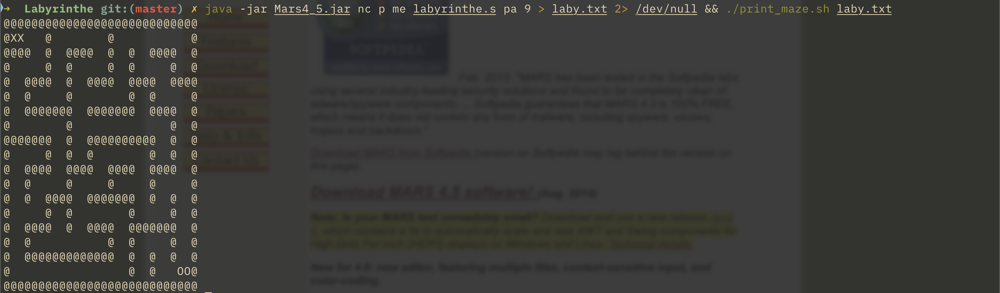

# Project Labyrinth

[](README.md)
[](README.fr.md)

This is project Labyrinth. It is a random square labyrinth generator of a given size with one and only one solution. It is written in MIPS assembly and runs in the MARS simulator. It generates a random labyrinth at each execution with a unique solution.



## Introduction

This project was made for the 3rd semester "Computer Architecture" class of the Computer Science degree at the University of Strasbourg, during the school year of 2022-23. It was made in **6 days** during the single week of holidays starting on October 31st. It was turned in on Sunday November 6th. 😳

The file that was turned in for the project is named `labyrinthe.s` containing the MIPS assembly source code. It is to be run with the [MARS](http://courses.missouristate.edu/KenVollmar/MARS/) simulator included.

With the [pdf of the subject](https://github.com/GreengagePlum/Labyrinthe/blob/master/ProjetArchi.pdf) (in French) you can learn about the project. Sadly from an optimization, complexity and efficiency standpoint, it is not the best even though I followed the suggested progression with precision.

### Final fix (11.14.2023)

At the time when I turned in this project on 11.06.2022, for various reasons (severe time limitations, being a novice developer without much vision...), I couldn't get all that was asked in the subject and the spec a 100% right. Notably, I had replaced the described algorithm in the subject by another simpler one by a false impression and worry of complexity and unimaginable execution times. But at the time when I found out that actually there was no problem, it was too late to rewrite some parts to implement the suggested algorithm as is and get rid of the deviations introduced compared to the subject.

This difference in the algorithm choice was the reason for which the output (the randomly generated labyrinth with a unique solution) was not even close to the examples in the subject. Although everything until the final step which was the output, all the other internal systems were working without any issue. But at that time I was thinking the problem was bigger and more complicated than just the difference in the algorithms.

The fact that I couldn't provide a result up to spec, mainly due to time limitations was annoying me since I had turned in the project. But sadly the school year was moving on at full speed and I couldn't come back to this project to leave it in a correct and complete state.

But here I am 💪, back again on 11.14.2023 (after exactly a year, what a coincidence 🤔) to not let my efforts be in vain, having accumulated more knowledge and experience in computer science (now in my senior (3rd) year) coming to correct the past. One last effort, to let this project rest in peace, it deserves it... 🫡

The few small changes (surprising how they were actually simple) that I've done are the following:

* Change the seed for the provided pseudo random generator in `Alea.s` with the system clock at each call to have a correctly random labyrinth generation.
* Replace the algorithm completely with the one in the subject found in the function `generer_laby`. (My deviated algorithm traversed the labyrinth cells linearly one time choosing each time a not visited neighbor for each cell and break the wall between these two. Of course this was not ensuring a random labyrinth with a unique solution like asked in the spec. So I replaced the algorithm with the one suggested in the subject word for word. Put the first cell of the labyrinth in a stack while marking it visited. While the stack is not empty take the top of the stack and make it the current cell, look for its not visited neighbors, pick one at random if there are any, break the wall between these two cells, push the neighbor into the stack, if the current cell has no neighbors left unvisited then pop.)
  * Use the second byte of the memory words that store the cells of the labyrinth to store the cell's index in the cell itself, without another data structure (bits number 8+) in the stack representing the labyrinth. (Extension to the project subject since I'm lazy to do more, my goal is nothing but to make this project functional at this point. Normally, I shouldn't be using more than 8 bits to represent the cells)
  * Fix and simplify the function `cell_mettre_bit_a0` so that it doesn't touch any other bits than the one given. (So that the solution in the previous point works)
  * Improve the function `creer_laby` to create an initial labyrinth but with the indices encoded in the corresponding cells.
  * Fix the function `nettoyer_laby` to put all the bits to 0 for each cell except the first 6.

These changes do no more than make the project functional with the output and the functioning now up to spec. But this is still not its ultimate version: the most readable, the best documented or the most optimized. Doesn't matter though, it works and it works well. It was an enjoyable fun challenge that made me think, and that's what matters. I learned a lot thanks to this project.

There is also a report paper for the project named `Rapport.pdf` in the [official turn in](https://github.com/GreengagePlum/Labyrinthe/tree/Rendu_Final) iteration (in French) to inform you about the difficulties that I had and my implementation choices during my initial work on this project. Take a look at this version to see the project in its state at the time of the official turn in that was on November 6th 2022.

## How to run

First off, make the shell script `print_maze.sh` executable (if it's not already the case) by:

```bash
chmod u+x print_maze.sh
```

Then, run these two commands by putting the desired size you want inside the **[2; 9]** range:

```bash
java -jar Mars4_5.jar p me labyrinthe.s pa {size of the labyrinth} > laby.txt

./print_maze.sh laby.txt
```

You have to have a version of `java` compatible with MARS installed and present on your `$PATH`. The [MARS documentation](http://courses.missouristate.edu/KenVollmar/MARS/Help/MarsHelpIntro.html) suggests the following on the necessary version of Java: "MARS is written in Java and requires at least **Release 1.5** of the J2SE Java Runtime Environment (**JRE**) to work."
